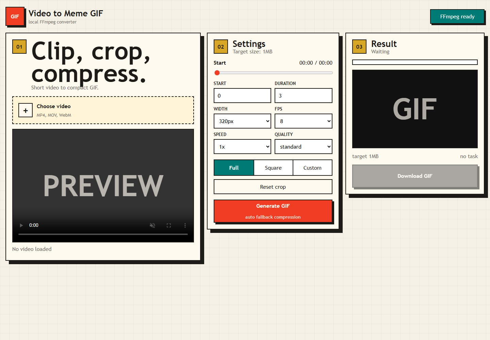

# Video to Meme GIF

A small local web app that turns short video clips into chat-ready GIF stickers.
It runs through FastAPI and FFmpeg, supports crop, speed, width, FPS, and quality
settings, then falls back through smaller encodes to target a compact GIF.



## Features

- Upload MP4, MOV, or WebM videos up to 50MB.
- Clip up to 5 seconds from a source video up to 180 seconds.
- Choose output width, FPS, playback speed, and quality mode.
- Crop as full frame, square, or custom region.
- Generate GIFs with FFmpeg `palettegen` and `paletteuse`.
- Automatically retry smaller width/FPS/color settings until the GIF is under the target size.
- Preview and download the result from a browser.

## Requirements

- Python 3.10+
- FFmpeg and FFprobe available on `PATH`

Install FFmpeg:

```powershell
winget install Gyan.FFmpeg
```

or on Ubuntu/Debian:

```bash
sudo apt update
sudo apt install -y ffmpeg
```

## Quick Start

```bash
pip install -r requirements.txt
uvicorn gif_toolkit.app:app --host 127.0.0.1 --port 8503
```

Open:

```text
http://127.0.0.1:8503
```

## API

```http
GET /api/gif/status
POST /api/gif/create
GET /api/gif/tasks/{task_id}
GET /outputs/{filename}
```

`POST /api/gif/create` expects multipart form data:

| Field | Default | Notes |
| --- | --- | --- |
| `file` | required | MP4, MOV, or WebM |
| `start_time` | `0` | seconds |
| `duration` | `3` | max 5 seconds |
| `width` | `320` | 160 to 720 |
| `fps` | `8` | 4 to 20 |
| `speed` | `1` | 0.5 to 2 |
| `target_size` | `1048576` | max 5MB |
| `quality_mode` | `standard` | `small`, `standard`, `high` |
| `crop_mode` | `full` | `full`, `square`, `custom` |
| `crop_x`, `crop_y`, `crop_w`, `crop_h` | full frame | normalized values, only used by `custom` |

## Tests

```bash
pytest tests -q
```

## Project Layout

```text
gif_toolkit/
  app.py
  services/
    gif_converter.py
    gif_tasks.py
static/
  index.html
  css/app.css
  js/app.js
tests/
```

## License

MIT
